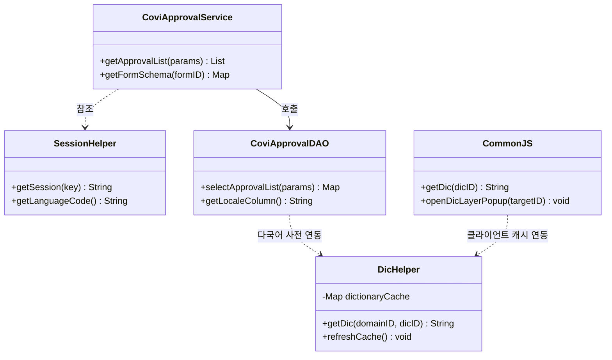
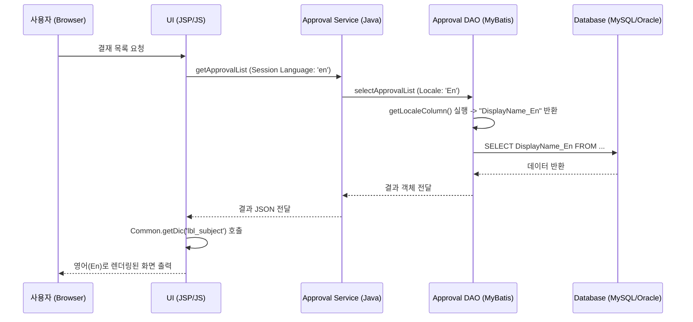

# [고객 검수용] 전자결재 다국어 처리 통합 프로그램 상세 명세서

## 1. 개요 (Overview)
- **프로그램 ID**: PRG_EA_ML_FINAL
- **프로그램명**: 전자결재 사용자 기반 로케일 동적 렌더링 통합 모듈
- **적용 범위**: 전자결재(Approval) 전체 모듈 (상신, 결재, 목록, 환경설정)
- **목적**: 전사 사용자의 개인별 언어 설정(`LanguageCode`)을 추적하여 시스템의 모든 텍스트 요소를 동적으로 국지화하여 표시함.

---

## 2. 아키텍처 설계 (Architecture Design)

### 2.1 클래스 다이어그램 (Class Diagram)


### 2.2 시퀀스 다이어그램 (Sequence Diagram)


---

## 3. 데이터베이스 설계 (Database Design)

### 3.1 사용자 정보 (sys_object_user)
| 컬럼명 | 타입 | 필수 | 설명 |
| :--- | :--- | :---: | :--- |
| UserCode | VARCHAR(100) | PK | 사용자 고유 코드 |
| **LanguageCode** | VARCHAR(5) | O | 사용자 설정 언어 (ko, en, vi, ja 등) |

### 3.2 다국어 사전 (sys_base_dictionary)
| 컬럼명 | 타입 | 필수 | 설명 |
| :--- | :--- | :---: | :--- |
| DicID | VARCHAR(255) | PK | 다국어 고유 키 (예: lbl_subject) |
| Ko | TEXT | - | 한국어 값 |
| En | TEXT | - | 영어 값 |
| Vi | TEXT | - | 베트남어 값 |

---

## 4. 프로그램 로직 상세 (Program Logic)

### 4.1 Java (Server Side) - 로케일 처리
```java
/**
 * 전자결재 DAO에서 현재 로케일에 맞는 DB 컬럼명을 동적으로 반환
 */
public String getLocaleColumn(String baseColumn) {
    String lang = SessionHelper.getSession("LanguageCode"); // 세션에서 언어코드 획득
    String suffix = "Ko"; // 기본값
    
    if (lang.equalsIgnoreCase("en")) suffix = "En";
    else if (lang.equalsIgnoreCase("vi")) suffix = "Vi";
    
    return baseColumn + "_" + suffix; // 예: DisplayName_En 반환
}

/**
 * 다국어 사전 데이터 조회 (Service Layer)
 */
public String getLocalizedLabel(String dicID) {
    return DicHelper.getDic(SessionHelper.getSession("DN_ID"), dicID);
}
```

### 4.2 UI/UX (Client Side) - 동적 렌더링
```javascript
// 1. 고정 UI 레이블 처리
$("#title_label").text(Common.getDic("lbl_approval_title"));

// 2. 다국어 입력 컨트롤 (양식 관리자 등)
// HTML: <input type="text" kind="dictionary" id="dic_input" />
function openMultilangPopup() {
    var targetID = "dic_input";
    coviCmn.openDicLayerPopup(targetID); // 다국어 팝업 호출 (Ko, En, Vi 동시 입력)
}
```

---

## 5. 인터페이스 정의 (Interface Definition)

### 5.1 내부 인터페이스 (API)
- **ID**: API_EA_GET_DIC
- **기능**: 요청된 키에 대한 로케일별 문자열 반환
- **Method**: `GET /covicore/control/getDic.do`
- **Parameter**: `dicID` (String)
- **Response**: `{ "status": "SUCCESS", "dicValue": "English Text" }`

---

## 6. 제약 및 특이사항 (Constraints)
- **동적 번역 한계 (GAP)**: 본 명세서는 정적 사전(Dictionary) 기반의 처리를 정의하며, 사용자가 직접 입력하는 결재 본문(HTML)의 실시간 번역은 표준 아키텍처 범위 외 사항임.
- **성능 최적화**: 다국어 데이터는 `Redis` 캐시를 통해 관리되며, 데이터 변경 시 `refreshCache()` 호출이 필수적임.

---
**작성일**: 2026-03-24
**작성기관**: 유티아이 베트남 그룹웨어 구축팀 (Dev Team)
**승인**: [고객사 승인 대기]
