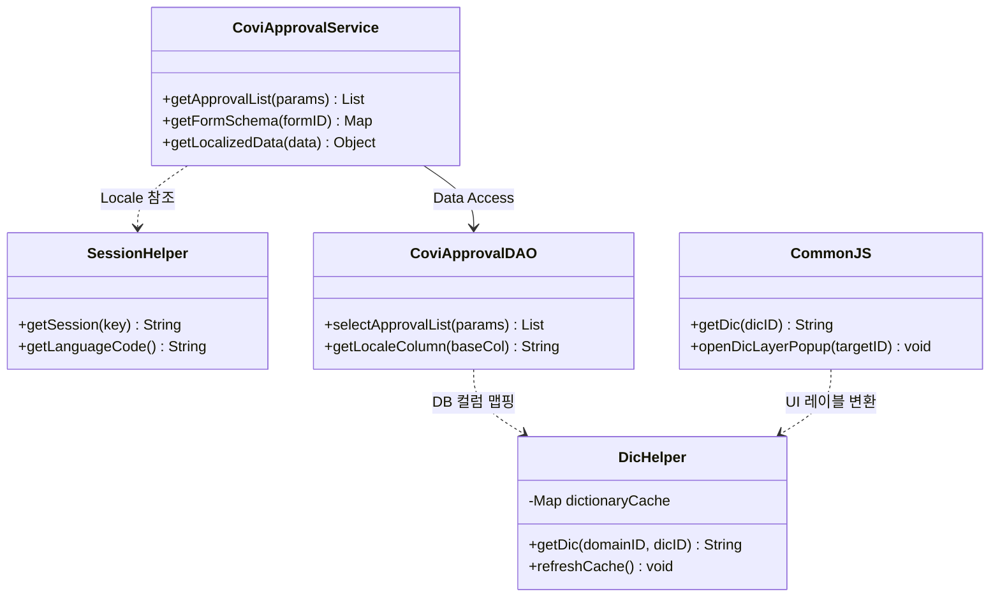
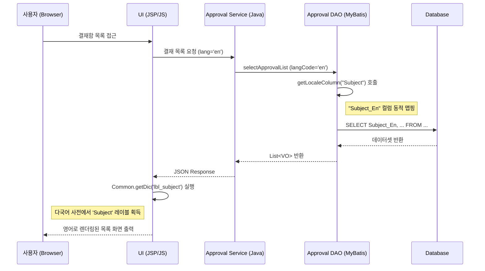

# [기술 상세 명세서] 전자결재 사용자별 언어 동적 렌더링 시스템 (PRG_EA_ML_FINAL)

## 1. 개요 (Introduction)
### 1.1 목적
본 프로그램은 유티아이 베트남 그룹웨어의 전자결재 모듈에서 사용자의 개인별 언어 설정(`LanguageCode`)에 따라 시스템의 모든 가독 요소(UI 레이블, 메시지, 마스터 데이터)를 동적으로 국지화(Localization)하여 표시하는 것을 목적으로 한다.

### 1.2 범위
- 전자결재 전 모듈 (상신, 결재함, 양식함, 환경설정)
- 조직도 및 사용자 프로필 연동
- 다국어 사전(Dictionary) 시스템 연동

---

## 2. 시스템 아키텍처 (System Architecture)

### 2.1 클래스 다이어그램 (Class Diagram)


### 2.2 시퀀스 다이어그램 (Sequence Diagram)


---

## 3. 데이터 설계 (Data Design)

### 3.1 DB 스키마 상세
| 테이블명 | 컬럼명 | 타입 | 설명 |
| :--- | :--- | :--- | :--- |
| **sys_object_user** | LanguageCode | VARCHAR(5) | 사용자별 선호 언어 코드 (ko, en, vi, ja) |
| **sys_base_dictionary** | DicID | VARCHAR(255) | 다국어 고유 키 (PK) |
| | Ko / En / Vi | TEXT | 언어별 실제 메시지 값 |
| **sys_base_config** | ConfigValue | VARCHAR(500) | 시스템 기본 로케일 및 지원 언어 설정 |

---

## 4. 상세 구현 로직 (Technical Implementation)

### 4.1 Java 로직 (Server Side)
- **로케일 기반 컬럼 처리**: MyBatis 쿼리 실행 전 인터셉터 또는 DAO 내에서 사용자의 언어 코드에 맞춰 조회 컬럼을 동적으로 변경한다.
```java
// DAO 로직 예시
public String getLocaleColumn(String baseColumn) {
    String lang = SessionHelper.getSession("LanguageCode");
    // ko -> "", en -> "_En", vi -> "_Vi" 형태의 접미사 생성
    String suffix = StringUtils.capitalize(lang.toLowerCase());
    return baseColumn + "_" + suffix;
}
```

### 4.2 JavaScript 로직 (Client Side)
- **UI 동적 변환**: 화면 로드 시 모든 하드코딩된 텍스트를 제거하고 다국어 키를 통해 렌더링한다.
```javascript
// UI 렌더링 예시
var label = Common.getDic("lbl_approval_date"); // 결재일자
$("#dateHeader").text(label);
```

### 4.3 UI 표준 및 컨트롤
- **다국어 입력 컨트롤**: `kind=dictionary` 속성을 사용하여 사용자가 직접 명칭을 입력하는 화면에서 다국어 팝업(`coviCmn.openDicLayerPopup`)을 자동 연동한다.

---

## 5. 인터페이스 명세 (Interface Specification)

### 5.1 다국어 사전 조회 인터페이스
- **Endpoint**: `/covicore/control/getDic.do`
- **입력**: `dicID` (String), `domainID` (Integer)
- **출력**: `dicValue` (String - 현재 사용자 언어에 맞는 값)
- **설명**: 클라이언트에서 특정 키에 대한 다국어 값이 필요할 때 호출하는 REST API.

---

## 6. 결론 및 특이사항 (Conclusion)
- **검수 포인트**: 본 시스템은 `DicHelper`와 `getLocaleColumn`을 핵심으로 하여, 데이터 저장 시점부터 조회 시점까지 로케일 일관성을 유지함.
- **GAP 대응**: 사용자가 입력한 '결재 의견' 등 비정형 데이터에 대해서는 현재 표준 사전 시스템이 아닌 별도의 번역 엔진 연동이 필요함(향후 과제).

---
**작성일**: 2026-03-24
**작성기관**: 유티아이 베트남 그룹웨어 사업단 (Development Team)
